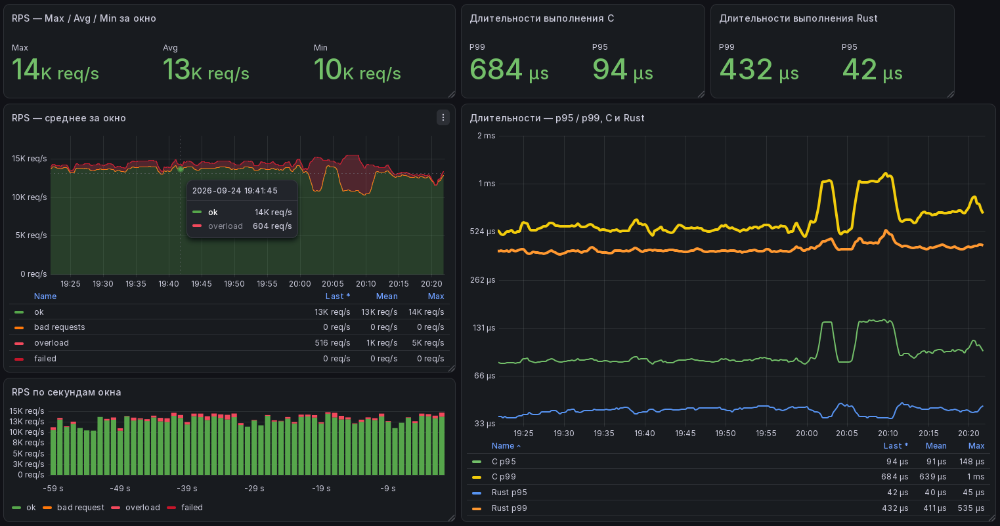

# cdnnow-test-golang-14

Go-переписывание Python-сервера и генератора нагрузки. Цель - рост производительности и наблюдаемости. Вычисления выполняются исходными библиотеками `c_lib` (C, `add`) и `rust_lib` (Rust, `sub`); Go-код обеспечивает только инфраструктуру.

## Требования

- Go 1.26.5+
- GCC
- Rust и Cargo
- Linux (`dlopen`, `.so`)
- Docker и Docker Compose - опционально

## Быстрый старт

```sh
make build

# терминал 1
./bin/server

# терминал 2
./bin/generator
```

> Сервер занимает консоль и периодически печатает `sum` и `sub`, поэтому запускайте его в отдельном терминале.

Проверка:

```sh
curl http://localhost:8080/ping
curl -X POST 'http://localhost:8080/calc?num=42'
curl http://localhost:8080/metrics
```

После `make build` артефакты лежат в `./bin`. Перед `make test` и `make bench` нужен `make build-libs` (или `make build`).

Docker Compose - опциональный демонстрационный стенд с Prometheus и Grafana. Конфиги и дашборды - в `monitoring/`.

```sh
cd monitoring
cp dot.env.example .env
vi .env
docker compose up --build -d
```

- сервер: `http://localhost:8080`
- pprof: `http://localhost:6060/debug/pprof/`
- Prometheus: `http://localhost:9090` (только в Compose)
- Grafana: `http://localhost:3000`, admin:admin (только в Compose)
  <details>
      <summary>скриншот</summary>
      </img>
  </details>


## Сборка

- `make build-libs` - C и Rust библиотеки
- `make build-server` - Go-сервер
- `make build-generator` - Go-генератор
- `make build` - все
- `make test`, `make bench`
- `make clean`


## Конфигурация сервера

- `-host` - адрес привязки. По умолчанию `0.0.0.0`.
- `-port` - порт. По умолчанию `8080`.
- `-c-lib` - путь к `libcalculator.so`.
- `-rust-lib` - путь к `libcalculator_rust.so`.
- `-interval` - период печати `sum` и `sub`, секунды. По умолчанию `5.0`.
- `-calc-mode` - `sync`, `async`, `parallel`. По умолчанию `async`.
- `-max-conns` - максимальное количество TCP соединений к серверу. По умолчанию `0` - без ограничений.
- `-queue-size` - максимальный размер очереди. Применимо только для `async` и `parallel`. По умолчанию `1024`.
- `-pprof-addr` - адрес pprof. По умолчанию `localhost:6060`, пустая строка отключает.

По умолчанию библиотеки ищутся рядом с исполняемым файлом.

```sh
./bin/server -calc-mode parallel -queue-size 2048
```

### Режимы

| Режим      | Поведение                              | Когда выбирать |
|:-----------|:---------------------------------------|:---------------|
| `sync`     | клиент ждёт окончания вычислений       | нужно подтверждение, что вычисление выполнено |
| `async`    | ответ сразу после постановки в очередь | нужен гарантированный порядок `add` и `sub` |
| `parallel` | то же, `add` и `sub` параллельны       | порядок `add` и `sub` не важен |

Выбор между `async` и `parallel` зависит от числа ядер и соотношения полезной нагрузки и HTTP-сервера. На одном ядре `parallel` не дает прироста. На 4 и более ядрах обычно предпочтителен. Перед выбором снимайте профиль через pprof.

## API

`POST /calc?num=X` - `num` обязательный целый параметр.

- 200 - `ok`
- 400 - некорректный запрос
- 500 - внутренняя ошибка
- 503 - переполнение очереди (`async`, `parallel`)

`GET /ping` - 200 `ok`.

`GET /metrics` - метрики в формате Prometheus.

## Метрики

```text
# пример для calc_ok_1s; остальные *_1s устроены так же
# second - смещение в секундах: 0 - текущая (неполная) секунда, -1 - предыдущая, ..., -59 - самая старая в окне.
calc_ok_1s{second="0"} 123
calc_ok_1s{second="-1"} 123
calc_ok_1s{second="-2"} 123
...
calc_c_duration_ns{quantile="0.95"} 15000
calc_c_duration_ns{quantile="0.99"} 20000
calc_rust_duration_ns{quantile="0.95"} 15000
calc_rust_duration_ns{quantile="0.99"} 20000
```

- `calc_ok_1s` - RPS за каждую секунду последней минуты.
- `calc_overload_1s` - Количество отброшенных запросов из-за перегрузки за каждую секунду последней минуты.
- `calc_bad_request_1s` - Количество битых запросов за каждую секунду последней минуты.
- `calc_failed_1s` - Внутренние ошибки сервера за каждую секунду последней минуты.
- `calc_c_duration_ns`, `calc_rust_duration_ns` - длительность `add` и `sub` в наносекундах.
- Окно 60 секунд, ротация раз в секунду. На дашборде `second=0` отбрасывается.

## Генератор нагрузки

- `-url` - endpoint. По умолчанию `http://localhost:8080/calc`.
- `-d` (`-duration`) - время выполнения (например `10s`, `1m`, `1h`). `0` - без ограничения. По умолчанию без ограничения.
- `-n` (`-threads`) - число воркеров. По умолчанию `10`.
- `-interval` - пауза между запросами, секунды. `0` - без паузы. По умолчанию `0.1`.
- `-timeout` - таймаут HTTP-запроса, секунды. По умолчанию `5.0`.
- `-no-keep-alive` - отключить keep-alive.
- `-percentiles` - печатать HDR-гистограмму времени выполнения.

```bash
./bin/generator -url 'http://localhost:8080/calc' -n 50 -interval 0.001 -percentiles
```

## Структура

```text
cmd/
  generator/    генератор нагрузки
  healthcheck/  проверка /ping
  server/       основной сервер
internal/
  api/          HTTP-роуты
  calculators/  режимы вычислений
  metrics/      агрегация метрик
  operators/    загрузка C и Rust
  pools/        пулы батчей
  queue/        дек на кольцевом буфере
c_lib/          C-библиотека
rust_lib/       Rust-библиотека
monitoring/     Prometheus и Grafana
docs/           документация
scripts/        вспомогательные скрипты
```

## Ограничения

- В `lib.rs` исправлен баг: нагрузочный цикл исчезал при компиляции, без правки замеры времени теряли смысл.
- `ParallelCalculator` дает только отложенную согласованность: в моменте `sum` и `sub` могут расходиться - порядок `add` и `sub` не гарантирован.
- `ParallelCalculator` проверяет перегрузку только на `Add`. После успешного `Add` `Sub` выполняется в режиме `IgnoreOverload`.
  При переполнении очереди `Sub`  блокирует клиента. На практике крайне редко: `Sub` не медленнее `Add` и, как
  правило, разгружается быстрее.
